# CodeCollab


Replace YOUR_GITHUB_USERNAME with your GitHub username to activate the badge.

Real-time collaborative code editing with operational transformation, live presence, and remote code execution.

## 1. Project Title

**CodeCollab**

Production-oriented collaborative coding platform for session-based, multi-user editing and execution.

---

## 2. Overview

CodeCollab addresses the need for shared coding sessions where multiple developers can edit the same source document concurrently, see each other's cursors, and execute code without leaving the session.

Why it exists:
- Reduce collaboration friction during pair programming, interview simulations, and mentoring sessions.
- Provide a simple URL-based collaboration model with optional account login or guest access.

Real-world use cases:
- Live technical interviews.
- Remote pair programming.
- Classroom or workshop exercises.

Business impact:
- Faster feedback loops in collaborative coding workflows.
- Lower onboarding friction through guest mode and link sharing.

Technical objectives:
- Conflict-resilient real-time editing via OT.
- Session persistence in MongoDB.
- Scalable real-time transport using Socket.IO with optional Redis adapter.

---

## 3. Key Features

### Backend
- Express API for authentication, session lifecycle, version history, and code execution.
- Socket.IO collaboration channel for operations, cursors, selections, language changes, and presence.
- Operational Transformation engine on the server to transform concurrent edits before broadcast.

### Frontend
- React single-page application with separate Home, Login, and Editor workflows.
- Monaco Editor integration for syntax-aware coding with language switching.
- Live collaboration UX: active users, remote cursors, connection state, save/restore history.

### Authentication
- Email/password registration and login using JWT issuance.
- Guest login flow that issues short-lived guest JWTs.

### Security
- Helmet and CORS configuration on the API server.
- API rate limiter on /api/* requests.
- Password hashing with bcrypt.

### DevOps
- Dockerfiles for frontend and backend.
- Docker Compose stack for client, server, MongoDB, and Redis.
- Nginx static serving for built frontend with SPA fallback and /api proxy.

### Performance
- Debounced document persistence after operation bursts.
- Session in-memory state for low-latency operation processing.
- Indexed unique sessionId in MongoDB for direct session lookup.

### Partially Implemented / Not Implemented
- AI: Not implemented.
- Monitoring/observability stack (Prometheus/Grafana): Not implemented.
- CI/CD workflows: Partially implemented (build and test workflow via GitHub Actions).
- Analytics dashboard/telemetry: Not implemented.

---

## 4. System Architecture

### High-Level Architecture

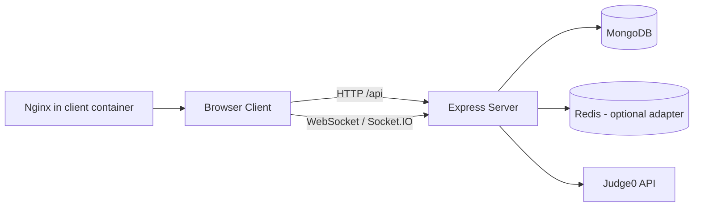

### Request Flow

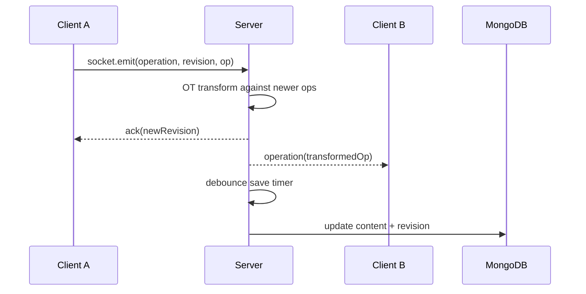

### Service Interactions

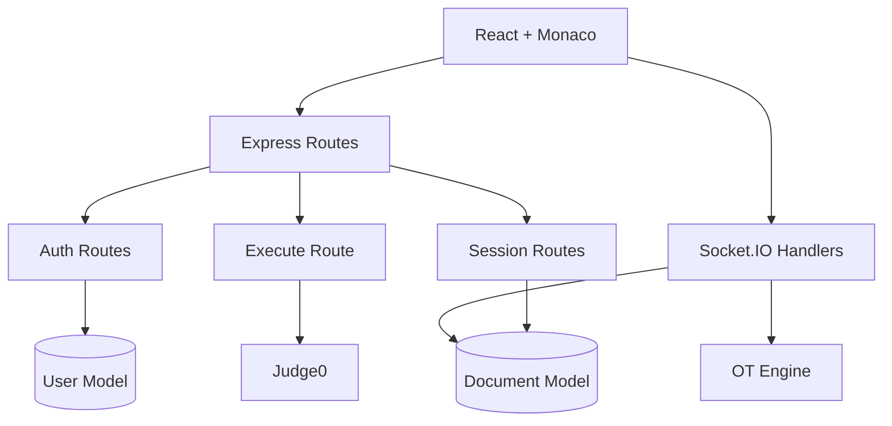

### Socket.IO Flow

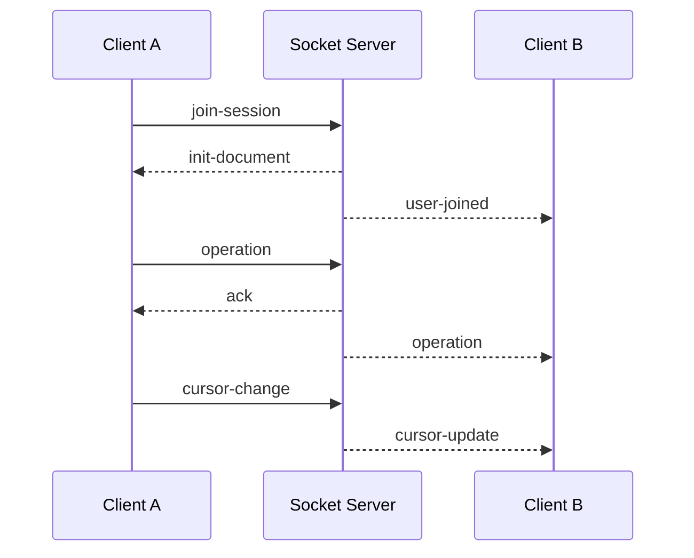

### Operational Transformation Flow

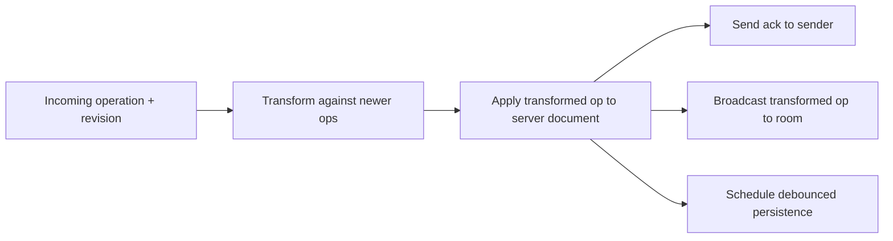

### Client <-> Server Flow

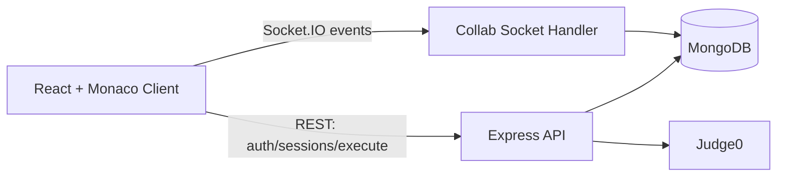

### Database Interactions

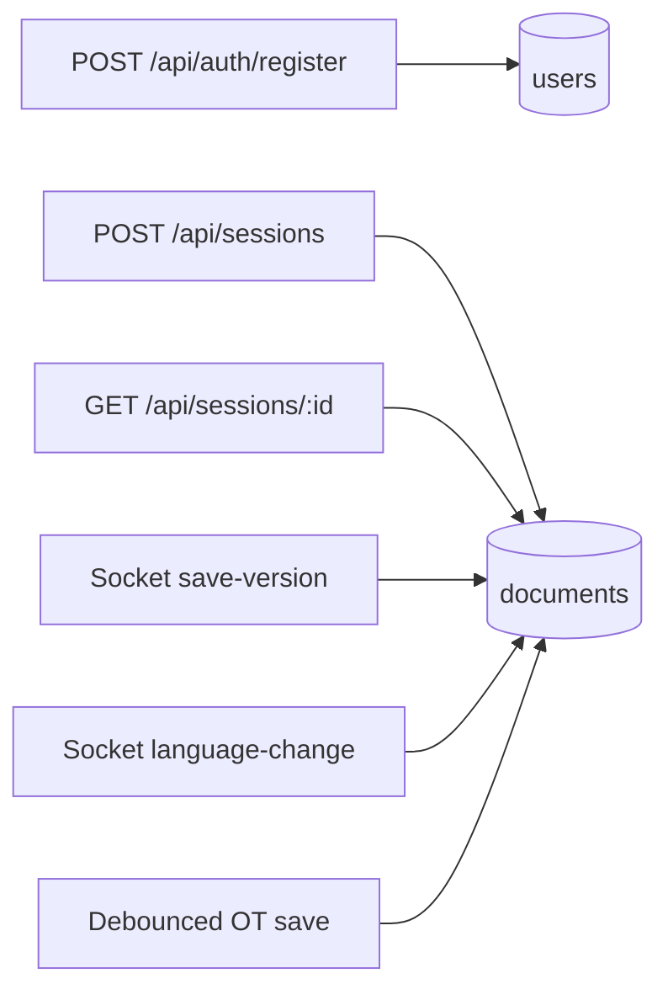

### Kafka Event Flow

Partially Implemented: **Not applicable in current codebase (no Kafka/message broker).**

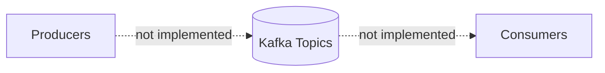

### AI Processing Pipeline

Partially Implemented: **Not implemented (no AI service/module).**

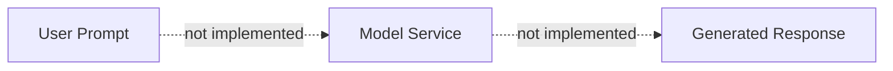

### Authentication Flow

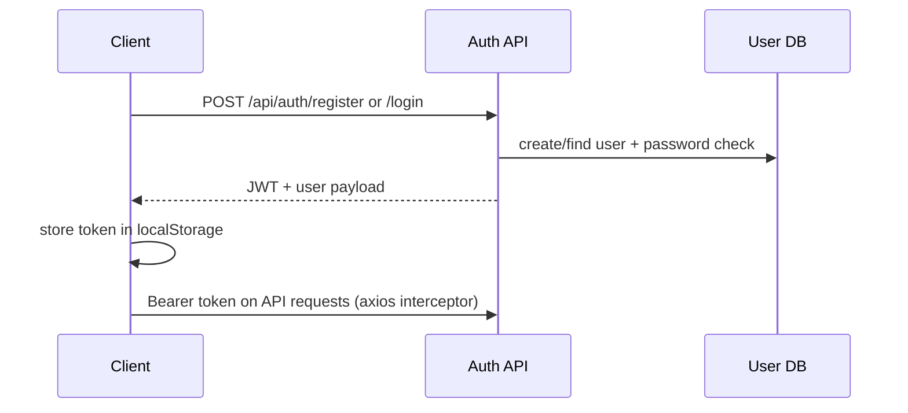

### Monitoring Architecture

Partially Implemented: **Not implemented beyond process/API health endpoint and console logging.**

```mermaid
flowchart LR
        APP[Server Process] --> H[/api/health]
        APP --> LOG[console logs]
        LOG -. no external sink configured .-> OBS[Monitoring Platform]
```

### CI Pipeline

Partially Implemented: **Implemented for build/test checks; release/deploy stages are not implemented.**

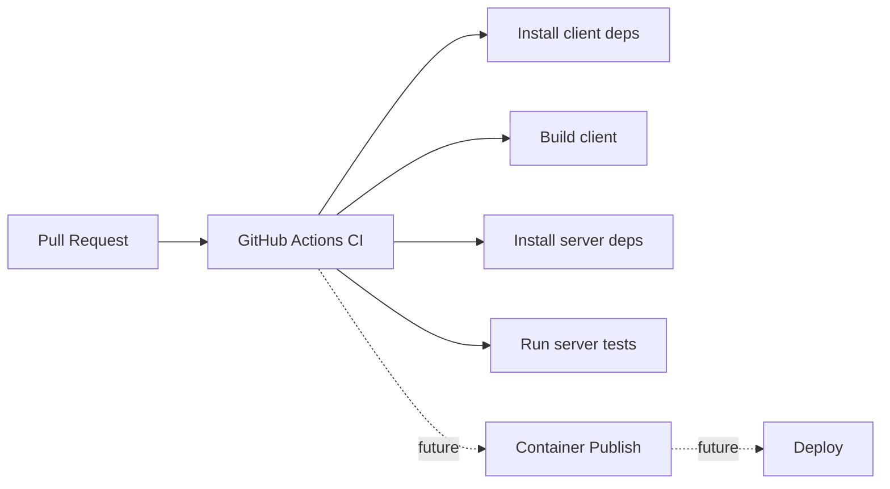

### Docker Architecture

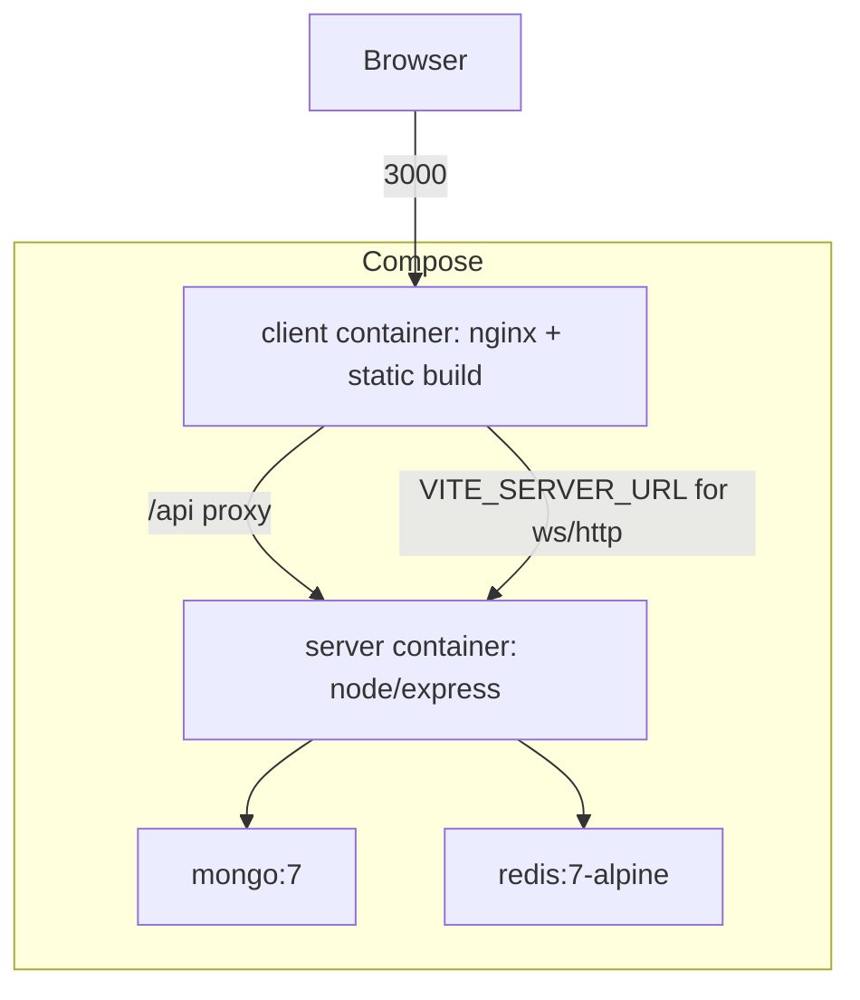

---

## 5. Technology Stack

| Category | Technology | Why It Is Used |
|---|---|---|
| Frontend | React 18, React Router, Vite | SPA architecture with fast dev/build pipeline and route-based UI separation. |
| Frontend Editor | Monaco Editor | Rich code editing experience with language support and editor APIs. |
| Backend | Node.js, Express | Lightweight HTTP API and middleware ecosystem. |
| Realtime | Socket.IO | Bidirectional transport with websocket + polling fallback. |
| OT Engine | Custom TextOperation OT | Conflict handling for concurrent edits. |
| Database | MongoDB + Mongoose | Document persistence for users/sessions/history. |
| Messaging | Redis adapter (optional) | Horizontal Socket.IO scaling path across server instances. |
| Code Execution | Judge0 API | Remote sandboxed code execution via HTTP API. |
| DevOps | Docker, Docker Compose, Nginx | Reproducible local stack and frontend serving/proxying. |
| Security | Helmet, CORS, bcryptjs, jsonwebtoken, express-rate-limit | Baseline API hardening and auth/token management. |
| Testing | Jest, Supertest | Unit tests currently cover OT engine logic; supertest is available for API testing expansion. |
| CI/CD | GitHub Actions | Automated CI workflow runs client build and server tests on push/PR to main. |
| Monitoring | API health endpoint + morgan/console | Basic runtime visibility; no metrics stack integration yet. |
| Cloud | Not implemented | No cloud deployment manifests or IaC in repository. |
| AI | Not implemented | No AI module or model integration exists in codebase. |

---

## 6. Project Structure

Root-level responsibilities:
- docker-compose.yml: Orchestrates local multi-container stack.
- client: React application and Nginx runtime artifacts.
- server: Express API, Socket.IO collaboration runtime, data models, OT server logic.

### client module responsibilities
- src/pages: Route-level screens (home/login/editor).
- src/components/Editor: Monaco wrapper and remote cursor rendering.
- src/components/Toolbar: Session controls, run/save/share, execution output panel.
- src/components/Sidebar: User presence and document history restore actions.
- src/context: Authentication/session state and token persistence.
- src/hooks: Collaboration lifecycle and event orchestration.
- src/ot: Client-side OT state machine.
- src/services: API and socket clients.

### server module responsibilities
- src/index.js: Server bootstrapping, middleware, route registration, database setup.
- src/routes: REST API endpoints for auth, sessions, and execution.
- src/socket: Room/session behavior and realtime event handlers.
- src/ot: OT engine implementation and transform logic.
- src/models: Mongoose schemas for User and Document.
- src/middleware: JWT auth middleware (currently not applied to routes).

---

## 7. Installation

### Prerequisites
- Node.js 20+
- npm 9+
- Docker + Docker Compose (for containerized setup)
- MongoDB and Redis (only required for non-Docker local run)

### Clone Repository

```bash
git clone <repository-url>
cd collab-editor
```

### Environment Setup

1. Copy server/.env.example to server/.env and fill in environment-specific values.
2. Copy client/.env.example to client/.env and set VITE_SERVER_URL.

### Docker Setup

```bash
docker-compose up --build
```

### Running Locally (Without Docker)

Backend:

```bash
cd server
npm install
npm run dev
```

Frontend:

```bash
cd client
npm install
npm run dev
```

---

## 8. Environment Variables

### Server (.env)

| Variable | Purpose | Required | Example Value |
|---|---|---|---|
| PORT | Express/Socket.IO listen port | No | 4000 |
| NODE_ENV | Runtime mode flag | No | development |
| MONGO_URI | MongoDB connection string | Yes | mongodb://mongo:27017/collab-editor |
| REDIS_URL | Redis connection for Socket.IO adapter | No | redis://localhost:6379 |
| JWT_SECRET | JWT signing key | Yes | use-your-own-random-secret |
| JWT_EXPIRES_IN | JWT expiry for user tokens | No | 7d |
| JUDGE0_API_URL | Execution provider URL | No | https://ce.judge0.com |
| JUDGE0_API_KEY | Reserved key variable (currently not sent in request headers) | No | your-key-here |
| CLIENT_URL | Allowed CORS origin / Socket origin | Yes | http://localhost:3000 |

### Client (.env)

| Variable | Purpose | Required | Example Value |
|---|---|---|---|
| VITE_SERVER_URL | Base URL for HTTP API and Socket.IO | Yes | http://localhost:4000 |

---

## 9. Running the Application

### Backend

```bash
cd server
npm run dev
```

Runs Express + Socket.IO on configured PORT (default 4000).

### Frontend

```bash
cd client
npm run dev
```

Runs Vite dev server on port 3000.

### AI Service

Partially Implemented: **Not implemented.** No separate AI runtime exists.

### Docker Compose

```bash
docker-compose up --build
```

### Development
- Frontend HMR via Vite.
- Backend auto-reload via nodemon.

### Production
- Frontend Docker image builds static assets and serves them via Nginx.
- Backend Docker image runs node src/index.js with production dependencies.

---

## 10. API Documentation

Swagger/OpenAPI: **Not available in current repository.**

### Authentication

#### POST /api/auth/register
- Auth required: No
- Description: Create a new user account.
- Request:

```json
{
    "name": "Jane",
    "email": "jane@example.com",
    "password": "password123"
}
```

- Response 201:

```json
{
    "token": "<jwt>",
    "user": { "id": "...", "name": "Jane", "email": "jane@example.com", "avatar": "" }
}
```

- Status codes: 201, 400, 409, 500

#### POST /api/auth/login
- Auth required: No
- Description: Authenticate an existing user.
- Request:

```json
{
    "email": "jane@example.com",
    "password": "password123"
}
```

- Response 200: token + user object
- Status codes: 200, 401, 500

#### POST /api/auth/guest
- Auth required: No
- Description: Issue a guest token and profile.
- Request:

```json
{
    "name": "GuestUser"
}
```

- Response 200: token + guest user object
- Status codes: 200

### Sessions

#### POST /api/sessions
- Auth required: No
- Description: Create new collaboration session.
- Request:

```json
{
    "title": "Untitled",
    "language": "javascript",
    "ownerId": "optional-user-id"
}
```

- Response 201:

```json
{
    "sessionId": "uuid",
    "title": "Untitled",
    "language": "javascript"
}
```

- Status codes: 201, 500

#### GET /api/sessions/:id
- Auth required: No
- Description: Fetch session metadata/content (history excluded).
- Status codes: 200, 404, 500

#### GET /api/sessions/:id/history
- Auth required: No
- Description: Fetch version history list.
- Status codes: 200, 404, 500

#### PATCH /api/sessions/:id
- Auth required: No
- Description: Update session title or language.
- Request:

```json
{
    "title": "New Title",
    "language": "python"
}
```

- Status codes: 200, 404, 500

### Execution

#### POST /api/execute
- Auth required: No
- Description: Execute source code via Judge0.
- Request:

```json
{
    "code": "print('hello')",
    "language": "python",
    "stdin": ""
}
```

- Response 200:

```json
{
    "output": "hello\n",
    "error": "",
    "status": "Accepted",
    "time": "0.01s",
    "memory": "12345 KB"
}
```

- Status codes: 200, 400, 500

### Health

#### GET /api/health
- Auth required: No
- Description: Server health and uptime probe.
- Status codes: 200

---

## 11. Database Design

Primary data entities:
- User: account identity and password hash.
- Document: collaborative session state, content revision, and version history.

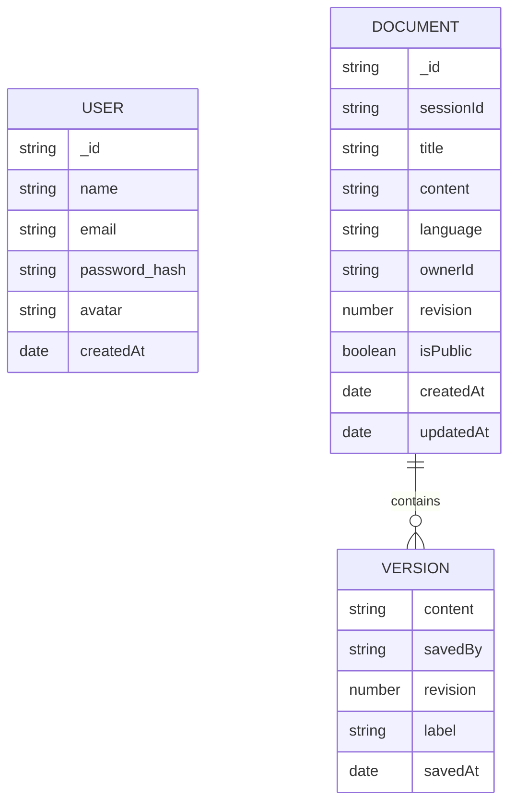

Relationship notes:
- Document.ownerId is a string reference pattern and is not enforced as a MongoDB foreign key.
- Document.collaborators is stored as a string array and is not relationally constrained.

---

## 12. Event-Driven Architecture

Socket-based event model is implemented through Socket.IO rooms.

### Events
- Producers: browser clients (operations, cursor changes, language changes, save-version).
- Consumer/dispatcher: server socket handler.
- Fan-out: server broadcasts to other clients in session room.

### Core event flow

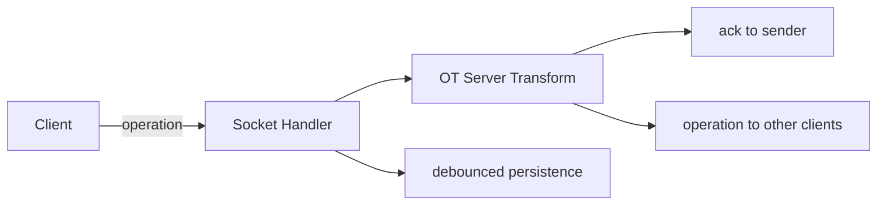

Failure handling and retry:
- Operation transform errors emit op-error event to sender.
- Socket reconnection is handled by Socket.IO transport behavior.
- No explicit dead-letter/retry queue exists.

Kafka/message-broker topics: **Not implemented.**

---

## 13. AI Module

Partially Implemented: **Not implemented.**

Current status:
- No prompt-processing component.
- No model provider integration.
- No AI response generation pipeline.
- No AI-specific error handling paths.

---

## 14. Security

Implemented:
- JWT authentication token issuance for registered and guest users.
- Password hashing with bcrypt pre-save hook.
- CORS restriction to CLIENT_URL.
- Helmet for security headers.
- Basic API rate limiting on /api routes.

Partially Implemented / Gaps:
- JWT auth middleware exists but is not applied to session/execute routes.
- No RBAC or document-level authorization checks.
- No explicit input sanitization pipeline beyond schema/type checks.
- JUDGE0_API_KEY env variable exists but is not used in outgoing headers.

---

## 15. Monitoring & Observability

Partially Implemented:
- Health endpoint at GET /api/health.
- HTTP request logging via morgan.
- Console logging for startup/socket errors.

Not implemented:
- Prometheus metrics.
- Grafana dashboards.
- Centralized log aggregation/tracing.

---

## 16. CI/CD

Partially Implemented: **Implemented for CI checks; deployment automation is not implemented.**

Current state:
- GitHub Actions workflow exists at .github/workflows/ci.yml.
- Workflow triggers on push and pull_request to main.
- Workflow installs dependencies for client/server, builds client, and runs server tests.
- No container publish or automated deployment stages.

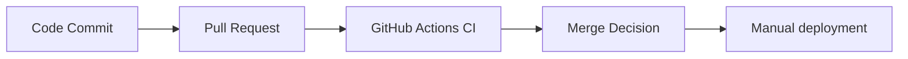

---

## 17. Performance Considerations

Implemented:
- OT operations processed in memory per active session for fast collaboration updates.
- Debounced database writes (2 seconds after last operation burst) to reduce write amplification.
- Unique indexed sessionId for efficient document lookup.
- History capped to last 50 versions to limit unbounded growth.

Not implemented:
- Query pagination.
- Multi-layer caching strategy.
- Connection pooling tuning beyond library defaults.
- Background job queue for async heavy workflows.

---

## 18. Future Enhancements

Planned (not implemented):
1. Enforce auth middleware on protected routes and add document-level authorization.
2. Expand CI pipeline with linting, container build verification, and deployment gates.
3. Add integration tests for auth, session lifecycle, and OT conflict paths.
4. Introduce structured observability (metrics, dashboards, and alerting).
5. Add richer execution controls (stdin UI, execution limits visibility, retries/timeouts).
6. Add production-ready secret management and environment template files.

---

## 19. Contributing

Contributions are welcome.

Recommended workflow:
1. Fork the repository.
2. Create a feature branch.
3. Make focused changes with clear commit messages.
4. Validate locally (client build, server startup, docker-compose up).
5. Open a pull request with problem statement, solution summary, and test notes.

Quality expectations:
- Keep changes scoped.
- Preserve API/socket compatibility unless explicitly versioned.
- Update documentation for behavior changes.

---

## 20. Testing

The project includes automated Jest unit tests for the Operational Transformation (OT) engine.

### Coverage

- Applying text operations.
- Concurrent operation transformation.
- Handling stale revision operations.

Run locally:

```bash
cd server
npm test
```

CI currently runs these tests via GitHub Actions on push and pull requests to main.

---

## Reviewer-Oriented Assessment

### Recruiter Perspective
- Demonstrates full-stack ownership across frontend UX, backend APIs, realtime systems, and containerized local deployment.
- Includes meaningful collaboration primitives (OT, presence, execution, history).

### Senior Engineer Perspective
- Strong baseline architecture for real-time collaboration and clear separation of concerns.
- Key production-hardening items remain: route authorization, test coverage, CI, and observability.

### Engineering Manager Perspective
- Project scope is well-bounded and extensible.
- Practical next milestones are clear for moving from functional prototype to production maturity.
